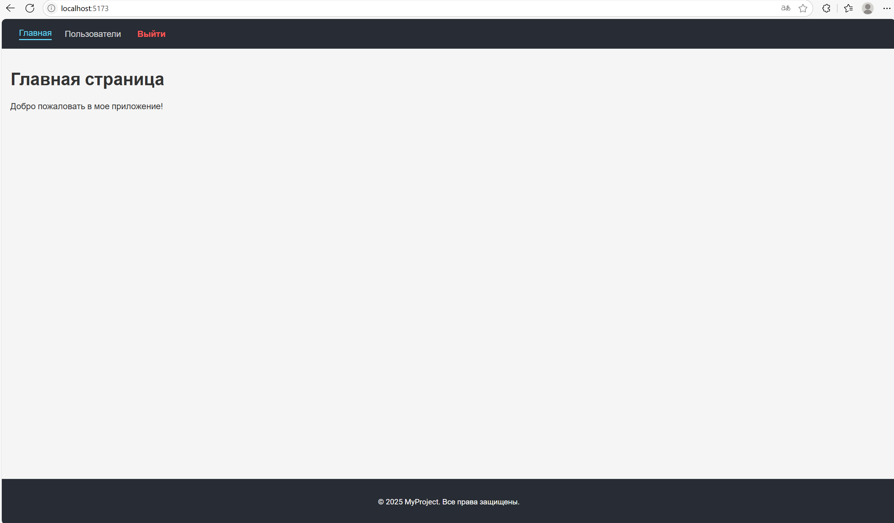
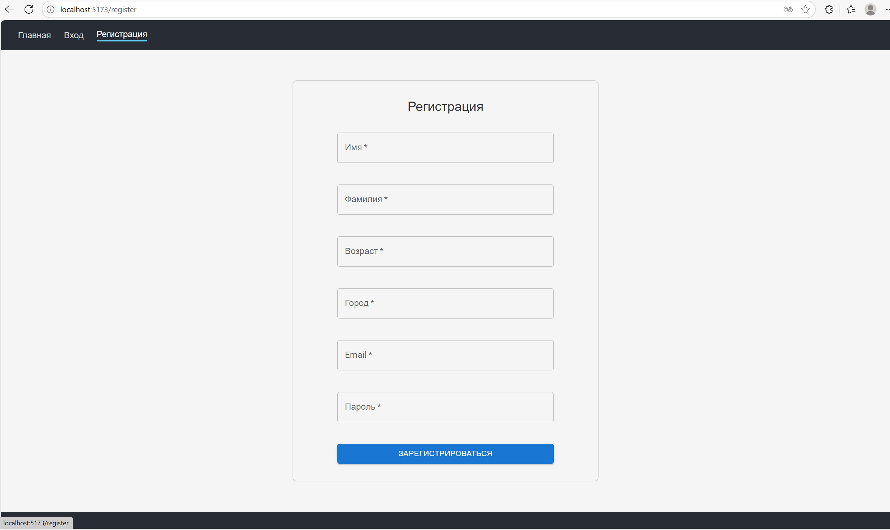
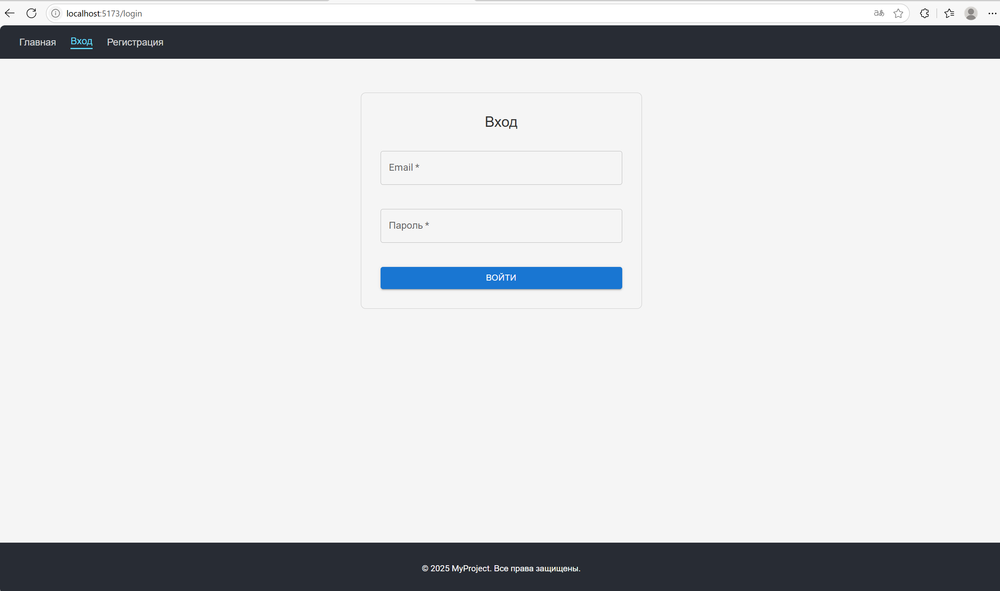
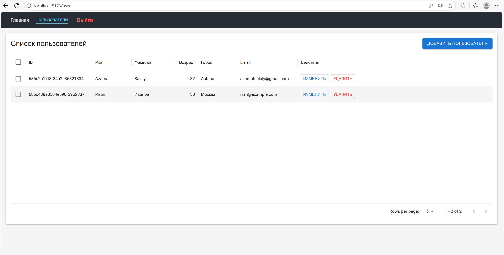

# User Management App

&#x20;

**Pet-проект** с регистрацией, авторизацией (JWT) и CRUD для пользователей на **Node.js**, **Express**, **MongoDB**, **React** и **Vite**.
Документация через **Swagger**, тесты — **Jest** + **Supertest**, контейнеризация — **Docker** + **Docker Compose**.

---

## 📑 Содержание

* [📸 Скриншоты](#-скриншоты)
* [🚀 Возможности](#-возможности)
* [📁 Структура проекта](#-структура-проекта)
* [⚙️ Установка (локально)](#️-установка-локально)
* [🐳 Docker](#-docker)
* [🧪 Тесты](#-тесты)
* [📚 Swagger](#-swagger)
* [🛠️ Технологии](#️-технологии)
* [📃 Лицензия](#-лицензия)

---

## 📸 Скриншоты

<div style="display: flex; flex-wrap: wrap; gap: 16px; justify-content: center;">
  <div style="flex: 1 1 300px; max-width: 300px;">
    
    <p align="center">Главная страница</p>
  </div>
  <div style="flex: 1 1 300px; max-width: 300px;">
    
    <p align="center">Страница регистрации</p>
  </div>
  <div style="flex: 1 1 300px; max-width: 300px;">
    
    <p align="center">Страница входа</p>
  </div>
  <div style="flex: 1 1 300px; max-width: 300px;">
    
    <p align="center">Список пользователей</p>
  </div>
  <div style="flex: 1 1 300px; max-width: 300px;">
    
    <p align="center">Добавление пользователя</p>
  </div>
</div>

---

## 🚀 Возможности

* **Регистрация / Вход** с защитой паролем (bcrypt) и JWT
* **CRUD**: создание, чтение, обновление, удаление пользователей
* **Валидация** входящих данных через Joi
* **Логирование** ошибок и запросов (Winston + Morgan)
* **Документация** API — Swagger (OpenAPI 3.0)
* **E2E-тесты** — Jest + Supertest + mongodb-memory-server
* **Контейнеризация**: Docker (backend, frontend, MongoDB)

---

## 📁 Структура проекта

```
Users_Express_MongoDB/
├── backend/
│   ├── database/          # Подключение к MongoDB
│   ├── logs/              # Логи Winston
│   ├── middlewares/       # Error handler, auth-check
│   ├── routes/            # auth.js, users.js
│   ├── validation/        # Joi-схемы и валидаторы
│   ├── tests/             # Jest + Supertest + E2E
│   ├── .env.example       # Пример env-переменных
│   ├── Dockerfile         # Сборка backend-контейнера
│   └── server.js          # Точка входа
│
├── frontend/
│   ├── public/            # index.html, favicon и пр.
│   ├── src/
│   │   ├── components/    # Header, Footer и др.
│   │   ├── pages/         # Login, Register, Users и др.
│   │   └── main.jsx       # Точка входа React
│   ├── Dockerfile         # Сборка + Nginx
│   ├── nginx.conf         # Конфигурация Nginx
│   └── vite.config.js     # Конфиг Vite
│
├── screenshots/           # Скриншоты UI для README
├── docker-compose.yml     # Orchestration frontend, backend, mongo
└── README.md              # Эта документация
```

---

## ⚙️ Установка (локально)

1. Клонируйте репозиторий и перейдите в корень:

   ```bash
   git clone https://github.com/your-username/Users_Express_MongoDB.git
   cd Users_Express_MongoDB
   ```

2. **Backend**:

   ```bash
   cd backend
   npm install
   cp .env.example .env
   # Отредактируйте .env по своему окружению:
   # MONGO_URI, JWT_SECRET, JWT_EXPIRES_IN, PORT
   npm start
   ```

   Сервер будет на `http://localhost:3000`

3. **Frontend**:

   ```bash
   cd ../frontend
   npm install
   npm run dev
   ```

   Приложение доступно на `http://localhost:5173`

---

## 🐳 Docker

Для запуска всех сервисов (backend, frontend, MongoDB) в контейнерах:

```bash
docker-compose up --build
```

* **backend**: `http://localhost:3000`
* **frontend**: `http://localhost:8080`
* **Swagger UI**: `http://localhost:3000/api-docs`

> Убедитесь, что порт 27017 свободен (или отредактируйте `docker-compose.yml`).

---

## 🧪 Тесты

Запуск тестов в **backend**:

```bash
cd backend
npm test
```

Покрытие тестами E2E, unit и интеграционный тесты.

---

## 📚 Swagger

Документация API генерируется автоматически и доступна по адресу:

```
GET http://localhost:3000/api-docs
```

---

## 🛠️ Технологии

* **Backend**: Node.js, Express, MongoDB (native driver), Joi, bcrypt, JSON Web Tokens, Winston, Swagger
* **Frontend**: React, Vite, MUI, Axios
* **Тестирование**: Jest, Supertest, mongodb-memory-server
* **DevOps**: Docker, Docker Compose, Nginx

---

## 📃 Лицензия

Этот проект распространяется под лицензией **MIT**.
